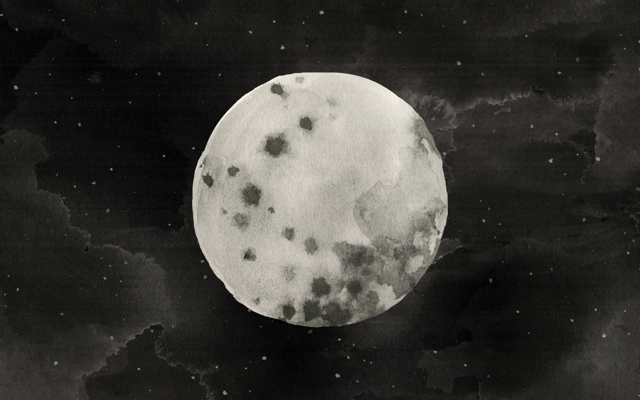
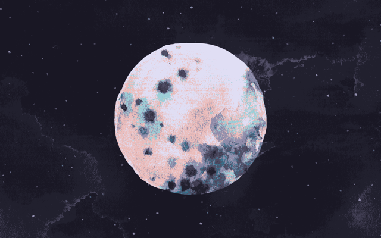
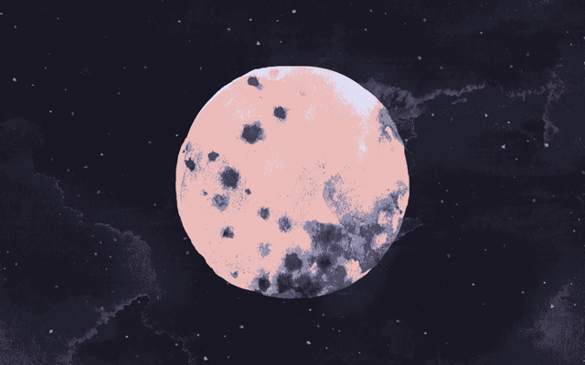
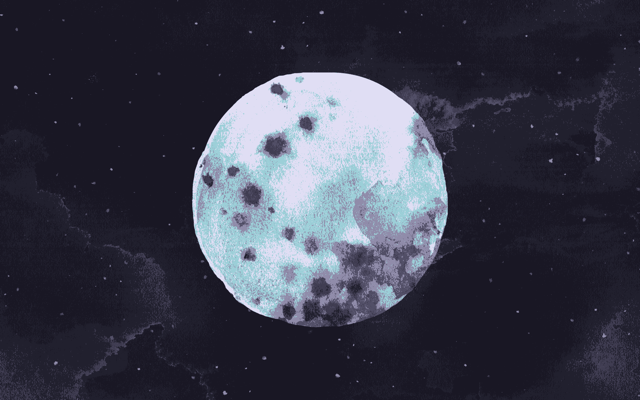

[Faerber](https://farbenfroh.io/) is an image generator that converts the palettes in your favorite wallpapers to fit a variety of themes, including our very own Rosé Pine.

The generator calculates the visual 'distance' between the colors of each pixel in the image and the colors in the specified scheme. It then maps each pixel to a new Rosé Pine color based on the result.

## Options

The tool offers four different color comparison methods (Delta E 76, Delta E 94-G, Delta E 94-T, and Delta E 2000) and various options for multi-threading. Using these controls, you can experiment with the level of detail and color effects given by each method. Here for Rose and Rose only? We love all our accents equally, but you don't have to -- try excluding colors to highlight your favorite accents or add a color and create something new.

## Examples

I tested the generator with one of my own favorite illustrations. Selecting the most modern method, Delta E 2000, resulted in a detailed, two-tone effect in the image I chose. The same image processed with Delta E 76 produced a colorwash with Rose as the dominant color. Removing Rose from the color palette created a more Foam-forward palette.

Each of these were generated with multi-threading set to `always` .

We recommend to give it a go with your own favorite images. Go forth and Rosé-Pine-ify!

Ciao! -Lynn

### Results

| None (original)                           | Delta E 2000                                         |
| ----------------------------------------- | ---------------------------------------------------- |
|  |  |

| Delta E 76                                       | Delta E 76 - Rose removed                                               |
| ------------------------------------------------ | ----------------------------------------------------------------------- |
|  |  |
